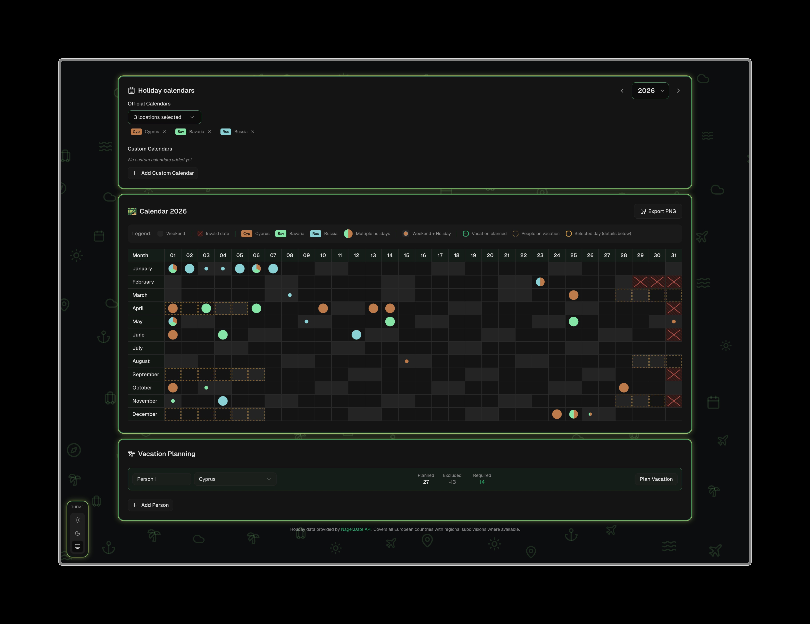
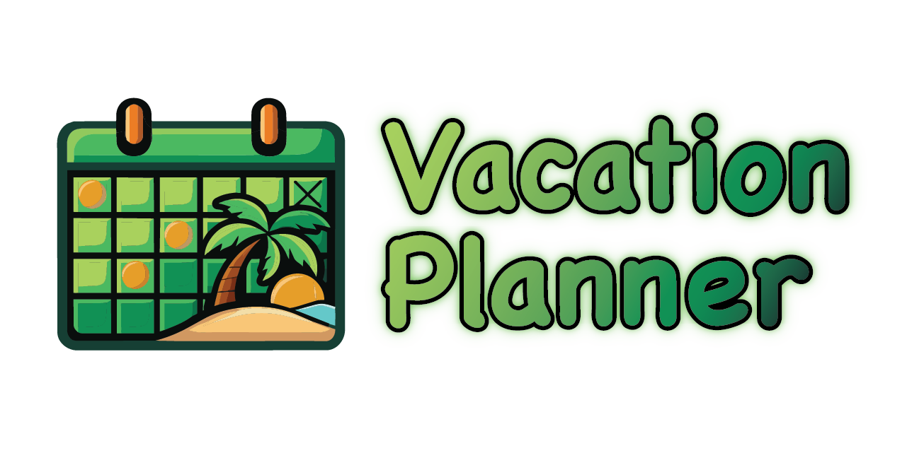

# Logo Story

This document captures the step-by-step story of how the Vacation Planner logo was created using AI tools and a bit of manual refinement. It is a quick narrative of the experiments, the pivots, and the small decisions that shaped the final mark.

---

I started the logo journey by asking ChatGPT for ideas and context, using a screenshot of the app UI to anchor the look and feel. The goal was to keep the friendly calendar vibe but add a clear travel cue that would feel at home alongside the dark UI.

ChatGPT returned a solid first draft that matched the vacation planning vibe I wanted. It already hinted at the mix of planning and escape, so it was a good base to iterate on.

Next, I asked for a clean version with the background removed so the mark could work on any surface. I needed a transparent version to test against different backgrounds and to judge the silhouette on its own.

After a couple of failed attempts to get a usable vector export, I switched to the AI tools inside Adobe Illustrator (using a free-trial period) to trace the image. I uploaded the latest raster version and asked for a clean line trace so the shapes could be edited precisely.

I made a few manual tweaks, mostly straightening lines and cleaning the grid. From there, I ran a couple of AI color-iteration passes on the sketch to explore palettes and shading before settling on the final look. Those iterations helped balance the greens and warm accents and clarified the contrast in the calendar cells. That process produced a refined standalone mark.

Finally, I paired the icon with the product name to produce the full lockup used in the app and docs. The typography keeps the same friendly tone while letting the icon carry the travel-and-planning story at a glance.

